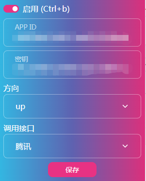
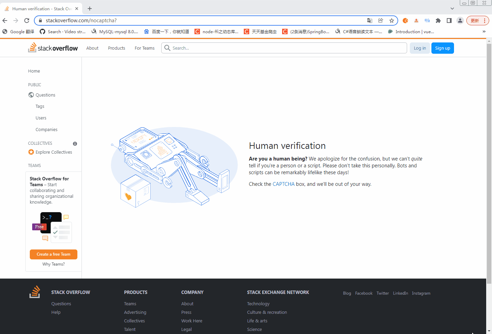
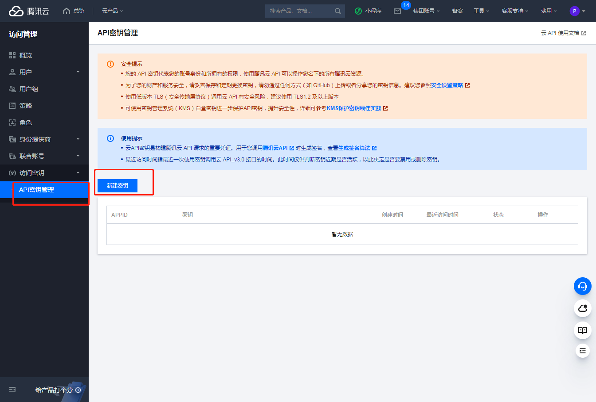
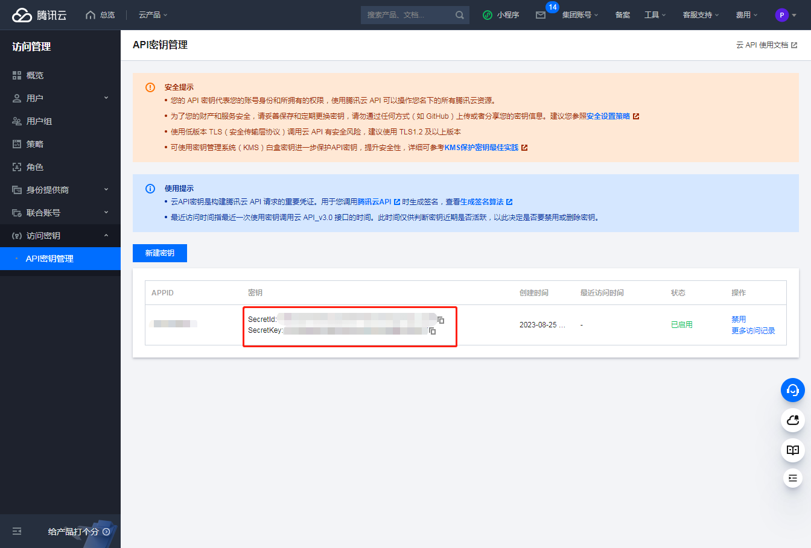
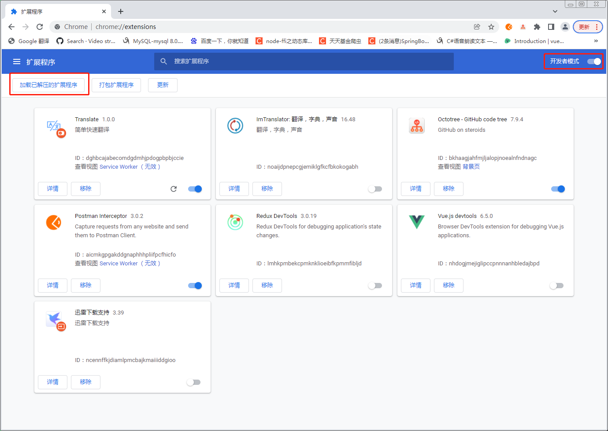
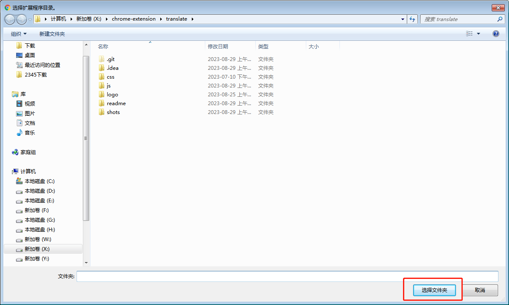

# Translate

[](https://github.com/claire/translate/releases)
[](https://opensource.org/licenses/MIT)
&nbsp;

这是一个Chrome翻译插件，致力于快速、简单翻译文本。欢迎体验。
## ✨ 功能

- 支持百度和腾讯翻译
- 界面简单
- 更多功能待开发...

## 🎉 应用界面


## ☑️TODO

- [x] 接入腾讯翻译
- [x] 接入其他免费翻译平台
- [ ] 剩余翻译额度提醒

## 🔧技术栈

- `Chrome Extension`
- `bootstrap`

## 📢 项目说明

- 兴趣之作，欢迎提出任何修改意见，但不保证任何更新以及功能的可靠性
- 程序无任何收费和用户信息收集行为，翻译接口须自行注册开通服务

## 🎨 截图
**单词翻译** 鼠标移动到需要翻译的单词上


**句子翻译** 鼠标点击选中需要翻译的句子



## 📝 文件说明

### background.js
后台脚本，生命周期和浏览器一致，一开始就执行，且一直执行
- 开始通过navigator获取当前的语言
- 通过chrome.runtime.onMessage.addListener进行事件监听
- 实现跨域fetch访问
- 全局变量保存在chrome.storage，通过接口chrome.storage.local.get和chrome.storage.local.set操作（需要在manifest中permissions申请权限）
### content.js
注入页面，在刷新当前页面或者打开新页面时执行。通过console.log可在F12中看到输出信息
- 获取鼠标下元素找到需要翻译的文本
- 拼接翻译url通过 chrome.runtime.sendMessage与background.js通信，拿到翻译后的文本替换原本元素
- 记录已翻译的元素防止重复请求，减少接口使用次数

### popup.js
打开界面执行，关闭结束
- 设置保存全局参数

### popup.html
点击扩展图标弹出popup页面

### manifest.json
提供插件基本信息，定义插件行为、权限、资源等

## 🏁 翻译API

### [百度翻译API](https://api.fanyi.baidu.com/doc/21)
- 在百度翻译开发平台注册账号并开通通用文本翻译
  [HTTPS 地址](https://fanyi-api.baidu.com/api/trans/vip/translate)

### [腾讯翻译API](https://cloud.tencent.com/document/api/551/15619)
- 注册并登陆腾讯云
- 申请机器翻译TMT(每月500万字符免费额度)
- 点击开通付费版
- 获取密钥
  [新建密钥](https://console.cloud.tencent.com/cam/capi)




- 复制密钥


#### 签名生成
[在线调试](https://console.cloud.tencent.com/api/explorer?Product=tmt&Version=2018-03-21&Action=TextTranslate)
参考生成签名demo NodeJS示列[参考文档](https://cloud.tencent.com/document/api/213/30654)
使用了[crypto-js](https://cdn.staticfile.org/crypto-js/3.1.2/rollups/hmac-sha256.js) 替代crypto生成签名
发送post请求后返回AuthFailure.SignatureFailure留意以下地方
- service是tmt，endpoint是tmt.tencentcloudapi.com
- 通过在线调试页面输入相同的时间戳生成签名，对比发送请求
- 添加X-TC-Language

## 🛠 快速开始

### 从源代码构建

```shell
git clone https://github.com/claire0821/translate.git
cd translate
```

### 安装
- 在chrome打开扩展程序 chrome://extensions/
- 打开开发者模式
- 加载已解压的扩展程序
- 选择项目根目录
  
  

## 🤝 交流反馈

- 提交📌Issues
  [gitee](https://gitee.com/claire0821/translate/issues)
  [github](https://github.com/claire0821/translate/issues)

## 📜 开源许可

- 基于 [MIT license](https://opensource.org/licenses/MIT) 许可进行开源。
